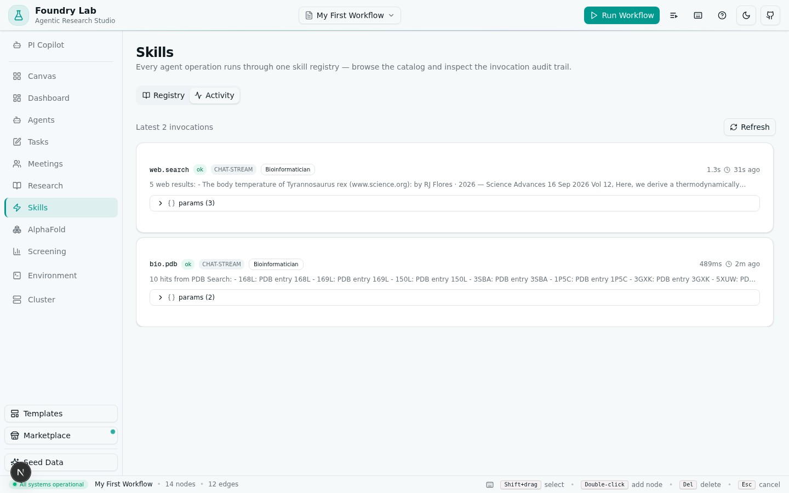
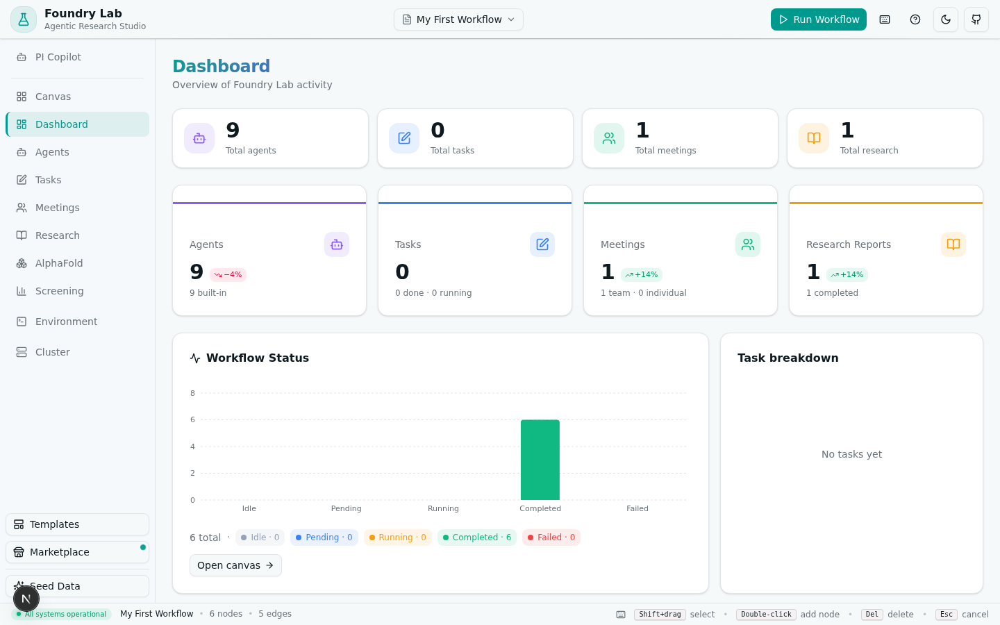

# Foundry Lab · 智能体科研工作流工作室

> 面向计算蛋白质设计的智能体研究工作流平台：在交互式画布上搭建多智能体工作流，
> 编排 LLM 智能体，并运行**真实计算算法** —— 没有任何模拟数据。


上图是一条真实跑通的完整工作流：`设计简报 → RFdiffusion 骨架生成 → ProteinMPNN 序列设计 → AlphaFold 结构预测 → 最终报告`，全部节点均为真实算法引擎执行完成（6 节点 · 5 条边）。

📖 **[完整使用攻略教程（图文并茂）→ docs/tutorial.md](docs/tutorial.md)**

---

## 目录

- [核心特性](#核心特性)
- [技术栈](#技术栈)
- [快速开始](#快速开始)
- [界面一览](#界面一览)
- [大规模筛选与排序](#大规模筛选与排序)
- [真实算法引擎](#真实算法引擎)
- [仓库结构](#仓库结构)
- [API 一览](#api-一览)
- [常见问题](#常见问题)

---

## 核心特性

### 🎨 工作流画布

拖拽式节点画布（自研 SVG 渲染，无 react-flow 依赖）：节点目录、端口感知连线、
小地图、撤销/重做、框选、自动布局、PNG/SVG 导出、乐观更新。
双击画布空白处或从左侧目录拖入即可添加节点。


每个节点自带检查器（右侧）：参数面板、运行日志（实时流式）、任务历史、
产物文件入口，一键跳转 3D 查看器。

- **手绘分组（持久化 + 可编辑）**：框选 2+ 节点 → `Ctrl+G` → 命名分组——彩色虚线组框
  （四色可选）保存到工作流（`Workflow.groups`），刷新 / 切换 / 版本恢复后都在；
  删除成员节点时组引用自动清理。点击组框可选中（✎/× 按钮），✎ 打开内联编辑器
  **重命名 / 换色**（防抖持久化）；组框**键盘可达**（Tab 停靠 + Enter/Space 选择 +
  Escape 取消——画布首个键盘可操作面）。成员全部折叠进 sweep 聚合卡时组框淡化为
  **ghost 幽灵框**——几何为各 sweep 聚合卡的**联合包围盒**（跨 sweep 组精确覆盖
  两个聚合位置），拖拽聚合卡时 ghost **实时跟随**（DOM transform 订阅，无帧渲染），
  仍可选中编辑。
- **模板/导入/市场加载确认**：加载模板、导入 JSON、安装市场模板都会**替换**
  当前工作流——替换前弹确认对话框（明示将删除的节点/边数量，并提示先存
  版本快照或换新工作流），空工作流直接加载不打扰。

### 🤖 智能体层

- **9 个预置专家人格**（PI、计算生物学家、免疫学家、结构生物学家……），每个智能体带
  知识域配置与系统提示词。
- **工具调用循环**（最多 5 轮，并行 bio + comp 工具调用）：智能体聊天中可自主调用
  BLAST / PDB / PubMed / UniProt 等真实 API。
- **技能标准化层（Skill Layer）**：所有智能体操作统一为技能 —— 单一注册表（18 技能
  4 族：comp / bio / web / canvas）、单一执行管道（解析→校验→门控→执行→审计）、
  单一审计表（SkillInvocation，含 source/agent/时长/五态状态）。能力门控
  （bioToolsEnabled / webSearchEnabled）在**执行层强制**；提示词清单从注册表实时渲染，
  与执行门控永不漂移；旧 ```tool / ```bio 围栏向后兼容归一。
- **Web 搜索技能**：智能体可真实联网检索（z-ai-web-dev-sdk），当前信息/文献/新闻
  直接折入回复。
- **持久化运行时参数**：微调对话框可配置 temperature / max-tokens / top-p /
  附加系统指令 / 流式输出，作用于该智能体的每一次 LLM 调用。
- **团队会议**：多智能体多轮辩论，产出结构化纪要。
- **研究管线**：规划 → 检索 → 撰写三阶段深度研究，输出 Markdown 报告。
- **PI Copilot**：悬浮于画布之上的 PI 助手，边看工作流边讨论。
- **技能面板（Skills）**：注册表浏览器（族分组/参数文档/搜索）+ 调用审计日志
  （状态/源/agent 归因/时长），每个智能体操作（聊天工具调用、工作流节点、
  PI 画布变更、REST 工具运行）都可观测。




### 🧬 计算工具（12 种独立节点）

RFdiffusion、RFantibody、ProteinMPNN、LigandMPNN、SolubleMPNN、Rosetta、
PyRosetta、RoseTTAFold3、ESMFold、ColabFold、AlphaFold2、Bio Tool ——
每个工具都是独立画布节点：原生 CLI 参数面、集群派发（直连 / Slurm）、
以及**内置真实算法引擎**作为本地回退（见下文）。

AlphaFold2 面板完整复刻集群教程流程：SSH 登录 → `salloc` 申请 GPU →
`module load alphafold2` → `run_alphafold.py`，输出树（ranked_0..4.pdb、
ranking_debug.json、msas/…）全量同步回本地。


### 🔬 生物信息 API

BLAST（NCBI URL-API + RID 轮询）、RCSB PDB 检索、PubMed EUtils、UniProt REST ——
全部在线真实调用，错误如实上报。

### 🧪 参数扫描（Campaign Mode）

选中任一工具节点 → Inspector 的 **Sweep** 按钮 → 勾选参数轴、填入取值网格，
一键把笛卡尔积（≤24 组合）展开为**变体节点组**：每个变体自动继承上游连线、
命名携带 `k=v` 标签、网格布局在源节点下方。支持创建后立即运行全部变体、
单次 Ctrl+Z 整组撤销（服务器同步删除，已完成的变体重建后保留其结果与
状态而非回到 idle）。变体输出直接进入筛选评估——`num_designs` /
`total_length` 等参数真实反映到输出文件数与结构长度。

> **依赖语义**：变体只继承源节点的**入边**。源节点没有上游时，每个变体都是
> 独立根节点——它们会并行启动（最多 3 车道）而不是等待源节点自己的输出。
> Sweep 对话框内对此有内联提示。

**Campaign 全链路闭环**（变体组 → 结论 → 筛选一步到位）：

- **参数轴模板**：对话框内置常用扫描阶梯（设计数阶梯 2/4/8/16、长度系列、
  采样温度、recycle 阶梯、对称体系、LLM 温度），按节点参数自动匹配一键填入。
- **Sweep 结果对比视图**：选中任一变体 → **Compare** 按钮 → 内联对比表：
  参数轴列 + 逐变体聚合指标（与筛选收割同一套提取规则）、列内最优值高亮、
  综合得分与 **Best** 榜冠、行点击跳画布定位变体。只读视图，不写数据库。
- **Sweep → Screening 一键衔接**：对比视图内 **Create screening campaign**
  把全部已完成变体的产物一次性收割为筛选 campaign，候选名携带变体溯源
  标签（`变体名/design_0`），参数轴自动绑定指标权重预设（如 `total_length`
  变体 → 几何指标加权）。变体节点卡片常驻 `sweep` 徽标，撤销/重做后组链接
  依然保持（组 id 随节点重建传递）。
- **变体聚合组卡**：点击变体卡上的 `sweep` 徽标 → 整组折叠为一张**组卡**
  （实时进度 = 完成数/总数、状态徽标、Compare 入口），点击组卡随时展开；
  组卡可直接**拖拽平移整组**（世界边界钳制，成员位置批量持久化，
  拖拽过程中连线实时跟随聚合卡位置——不再等释放重排）。
  大 sweep 不再淹没画布；折叠态连线自动聚合到组卡锚点（含小地图），
  搜索与分组框也只命中可见节点。
- **并行执行通道**：工作流按 DAG 依赖并行执行——无依赖的 sweep 变体同时
  运行（内置引擎并发上限 3），完成提示展示实际并行车道数；失败节点不阻断
  下游（与串行语义一致）。
- **自动布局防重叠**：新建 / sweep 变体网格 / 拖放落点全部做占用检测，
  冲突自动偏移到最近空位——两次 sweep 同源、连续快速新建都不会叠卡。
- **全局运行队列（Runs）**：顶栏 Runs 按钮（运行中数量徽标）打开跨工作流
  的实时队列：运行中/排队（3 秒轮询 + 进度条）、近 48h 失败节点一键
  **重试**（即时反馈 + 单节点重跑并级联下游）、最近完成（时长统计）；
  行点击直接跳到对应工作流并选中该节点。运行中的节点可以**中止**
  （Stop / Stop all：节点立即标记为 failed；在途执行的结果被丢弃，
  下游随之按失败语义解锁——已派发到集群的作业会一并取消，被取消的
  ToolJob 行在集群/AlphaFold 面板显示 `cancelled` + `via node stop`
  溯源徽标）；本地执行的每个节点受 15 分钟**看门狗**保护（集群长任务
  豁免——集群通道自带 30/120 分钟诚实轮询天花板），引擎挂死不再楔死
  并行池。

### 🖼️ 3D 结构查看器

基于 three.js 的分子查看器：cartoon / ball-stick / space-filling 表示、
链/残基着色、DSSP 二级结构标注、氢键、SASA、测量工具、序列条与选取联动。


### 📊 大规模筛选与排序

针对大规模批量结果（几十～上百候选）的完整评估体系：

- **指标采集**：自动收割运行产物中的 metrics（pLDDT、pTM、helix%、strand%、
  clashes、rama-LL、对称单元数……）。
- **加权综合评分**：`score = 100 · Σ(wᵢ·normᵢ)/Σwᵢ`，滑杆实时重排序，
  4 个预置权重方案（Balanced / Designability / 结构优先 …）可保存到服务端。
- **多维度操作**：搜索、状态过滤、指标范围过滤、三态排序、星标 / 入围 / 淘汰、
  批量操作、双候选并排对比（并列最优高亮）。
- **详情 + 3D**：每个候选可打开详情抽屉 —— 指标网格、着色序列、标签/笔记、
  真实 3D 结构。
- **结构叠合（Superpose 3D）**：对比视图选恰好 2 个带 PDB 的候选，或从**候选详情抽屉
  单卡直达**（选一个伙伴即叠合，当前候选为参考）→ 刚体叠合（Needleman-Wunsch
  序列比对 + Horn 四元数最优拟合）：双骨架叠加视图 + **逐残基偏差着色**（<1 Å 翠绿 /
  1–2.5 Å 琥珀 / ≥2.5 Å 玫瑰 / 未匹配灰）+ 全局 RMSD 芯片 + 偏差直方图 + 图例。
  叠合**不对称**（参考定住、移动结构着色）——对话框 **Swap 按钮**一键互换角色重算。
- **结构 RMSD 筛选指标**：选定一个参考候选 → 服务端为每个带 PDB 的候选计算全局
  Cα RMSD（序列比对 + 最优刚体拟合）并**写入指标体系**——与 pLDDT/clashes 等引擎
  指标完全同权：可排序、可区间过滤、可加权、随 CSV/报告导出；原子事务提交，
  参考标签与数值永不分离；重算换参考无陈旧残留。
- **Promote 回画布**：把选中的候选提升为画布输入节点，下游工具节点
  **自动接线** pdb/fasta 文件（已用真实 ProteinMPNN 运行验证闭环）。
- **导出 CSV / Markdown 报告**：选择子集或全量，报告含权重、全候选表、
  starred/shortlisted 摘要与 curated 笔记（"带走结论"）。


### ⏱️ 版本快照与定时调度

- 画布快照存入数据库，事务性恢复任意历史版本。
- DB 驱动的定时任务清扫器（随 `instrumentation.ts` 启动）：
  预约运行走与手动运行**同一条执行通道**，重启后错过的计划自动补跑。

### 🖥️ 环境与工具链管理（跨平台）

Environment 面板顶部是**平台横幅**：实时显示操作系统（含发行版）、架构、
shell、解析到的 Python 解释器，以及探测到的包管理器
（apt / dnf / pacman / zypper / brew / winget / choco / scoop / conda /
mamba / uv / pixi / pip …）。

- **检测跨系统**：二进制探测不依赖 `which`（直接扫描 PATH + Windows
  PATHEXT 扩展名），Linux / macOS / Windows 行为完全一致；Python 解析
  覆盖 python3 / venv / Windows `py -3` 启动器。
- **安装分通道**：pip 类命令重写到本机解释器执行（`<py> -m pip`，
  规避 PEP-668 拒装）；POSIX 安装脚本（git clone 流程、venv bin 路径）
  在 Linux/macOS 走 bash，在 Windows 自动路由到 **WSL bash**（无 WSL
  时给出可操作的提示而不是失败）。
- **系统级依赖一键安装**：python3 / git 缺失时按检测到的包管理器生成
  真实安装命令（如 `sudo apt-get install -y python3`、
  `brew install python3`、`winget install -e --id Python.Python.3.12`），
  一键可装性由扫描时实时判定。
- 安装过程流式终端日志、装完自动重扫；注册表支持按 OS 配置安装命令
  变体（`commandByOs`）。


### 📱 响应式与快捷操作

移动端完整可用：筛选结果自动切换为**卡片列表**（排名/评分条/指标），
节点画布**全屏可用**（节点目录变为按需滑出的浮层，加完节点自动收起），
`Ctrl+K` 命令面板、完整键盘快捷键、新手引导巡览。


---

## 技术栈

| 层 | 技术 |
|---|---|
| 框架 | Next.js 16（App Router）+ React 19 |
| 语言 | TypeScript 5（严格模式） |
| UI | Tailwind CSS 4 + shadcn/ui（New York）+ Lucide 图标 |
| 状态 | Zustand（客户端）+ 乐观更新 |
| 数据库 | Prisma ORM + SQLite |
| LLM | z-ai-web-dev-sdk（仅服务端） |
| 3D | three.js + Web Workers |
| 实时 | socket.io（任务事件流） |

## 快速开始

```bash
bun install
bun run db:push        # 初始化 SQLite schema
bun run dev            # http://localhost:3000
```

内置算法引擎的运行要求：`python3` + `numpy`（Tools/Environment 页面会实时探测，
缺什么就一键安装什么）。

> 首次进入会弹出新手引导；侧栏底部的 **Seed Data** 可一键生成 9 个智能体 + 示例工作流。

**演示数据基线**：内置两个示例工作流（`My First Workflow` 14 节点 / `Antibody
Design Campaign` 5 节点）与三个筛选 campaign（60 候选骨架筛选 / 20 候选
AF2 模型排名 / 6 候选抗体 Fv）。被实验弄脏后可用官方种子恢复：
>
> ```bash
> bun run demo:reset      # 恢复为演示基线（覆盖掉 db/custom.db）
> bun run demo:snapshot   # 把当前状态冻结为新的基线
> ```
>
> 重置后需重启 dev server（运行中的服务持有旧 SQLite 连接）。

## 界面一览

| 视图 | 说明 | 截图 |
|---|---|---|
| 新手引导 | 6 步交互式巡览 |  |
| 画布 | 节点编排 + 运行 |  |
| 节点检查器 | 参数 / 日志 / 产物 |  |
| 3D 查看器 | 真实 PDB 渲染 |  |
| 命令面板 | Ctrl+K |  |
| 筛选 | 大规模评估排序 |  |
| 权重 | 实时加权重排 |  |
| 对比 | 双候选并排 |  |
| 候选详情 | 指标 + 3D + 标签 |  |
| Promote | 筛选 → 画布 |  |
| 智能体 | 人格与知识配置 |  |
| 智能体聊天 | 工具调用循环 |  |
| 会议 | 多智能体辩论 |  |
| 研究管线 | 三阶段深度研究 |  |
| Dashboard | 全局统计 |  |
| 集群 | SSH / Slurm 派发 |  |
| PI Copilot | 画布悬浮助手 |  |

## 真实算法引擎

`scripts/algorithms/` 下是纯 numpy 实现的真实经典算法（无网络权重依赖），
作为外部工具未安装时的本地回退 —— **不是模拟数据，是真实计算**：

| 引擎 | 覆盖工具 | 算法 |
|---|---|---|
| `diffusion_engine.py` | rfdiffusion | Ramachandran 盆地扭转扩散 + 回溯 + NeRF 组装 |
| `fold_engine.py` | esmfold / rf3 / colabfold / alphafold | Chou-Fasman 预测 + 共识平滑 + 几何组装 |
| `mpnn_engine.py` | proteinmpnn 家族 | 基于真实骨架的知识势 Gibbs 逆折叠采样 |
| `score_engine.py` | rosetta / pyrosetta | MJ 接触势 + Rama 似然 + 溶剂化 + MC 最小化 |
| `antibody_engine.py` | rfantibody | 种系框架 Fv 构建 + IMGT 规范 CDR 采样 |

集群可用时优先走集群（原生 CLI）；不可用时自动回退引擎 —— 两条通道产物
走同一套收割/评估路径。

## 仓库结构

```
├─ docs/
│  ├─ images/            # 文档截图（本 README 与教程引用）
│  └─ tutorial.md        # 完整使用攻略教程（图文并茂）
├─ scripts/
│  ├─ algorithms/        # 5 个真实算法引擎（纯 numpy Python）
│  ├─ e2e/               # 可复现 e2e 验收装置（cluster-lane：集群通道全链路）
│  └─ foundry/           # 辅助脚本
├─ src/
│  ├─ app/
│  │  ├─ page.tsx        # 单页应用入口（唯一用户路由 /）
│  │  └─ api/            # REST API（tools / workflow / agents / screening / …）
│  ├─ components/
│  │  ├─ canvas/         # 画布（节点/边/小地图/检查器/导出）
│  │  ├─ screening/      # 大规模筛选评估与排序 UI
│  │  ├─ panels/         # 各功能面板（agents/meetings/research/…）
│  │  ├─ molecular/      # three.js 分子工作室
│  │  └─ ui/             # shadcn/ui 组件
│  ├─ lib/
│  │  ├─ workflow-engine.ts   # 节点执行引擎 + 自动接线
│  │  ├─ workflow-runner.ts   # 共享运行通道（手动+定时）
│  │  ├─ scheduler.ts         # DB 定时任务清扫器
│  │  ├─ screening.ts         # 筛选收割/评分/提升
│  │  ├─ real-executor.ts     # 真实命令执行
│  │  ├─ cluster/             # SSH 集群通道（派发/对账 sweep/取消/同步）
│  │  └─ molecular/           # 3D 引擎（worker/DSSP/SASA/…）
└─ instrumentation.ts  # 随服务启动调度器 + 孤儿运行对账
├─ mini-services/
│  ├─ mock-cluster/      # 本地测试集群（真 ssh2 SSH 服务器 + 迷你 SLURM + 真实引擎）
│  └─ job-events/        # socket.io 实时事件
├─ prisma/               # SQLite schema
└─ outputs/              # 运行产物（PDB/FASTA/metrics，可被 file API 服务）
```

### 可复现集群 e2e

集群执行通道（直连 / Slurm 派发、对账 sweep、输出同步、节点 Stop → 远端取消 +
`via node stop` 徽标、poll-ceiling 交接 → SSE 流 reconcile）有一条命令行验收通道：

```bash
( setsid bash -c 'cd mini-services/mock-cluster && exec bun run dev' >/dev/null 2>&1 </dev/null & )
bun run e2e:cluster            # 基础验收（直连 + Slurm + 流式对账 + 基线恢复）
# 完整验收（含 Stop 路径 + co-driver 实证）：见 docs/CONTRIBUTING.md 集群 e2e 节
```

跑真实 SSH 到 mock-cluster、执行真实 numpy 引擎，断言到引擎/文件/DB/流式事件级
证据，并自行把演示数据恢复到跑前基线。

## API 一览

| 方法 | 路径 | 用途 |
|---|---|---|
| POST | `/api/tools/run` | 运行计算工具（真实执行） |
| GET | `/api/tools/scan` | 环境扫描 |
| POST | `/api/tools/install` | 一键安装外部工具 |
| GET | `/api/tools/jobs/:id` | 任务状态 / 日志 / 文件 |
| GET/POST | `/api/workflow` | 工作流读取 / 全量运行 |
| POST | `/api/workflow/nodes` · `/edges` | 增删节点 / 连线 |
| POST | `/api/workflow/nodes/:id/run` | 单节点运行 |
| POST | `/api/workflow/nodes/:id/stop` | 中止运行/排队中的节点（标记 failed + 解锁下游） |
| POST | `/api/workflow/nodes/:id/sweep` | 参数扫描（网格展开为变体节点组） |
| GET | `/api/workflow/nodes/:id/sweep-group` | 变体组对比数据（参数轴 + 聚合指标，只读） |
| POST | `/api/screening`（`source.kind="sweep"`） | 一键收割整个变体组为筛选 campaign |
| GET | `/api/runs` | 全局运行队列（跨工作流 active/failed/recent + 汇总） |
| POST | `/api/workflows/:id/versions/:v/restore` | 恢复版本快照 |
| PATCH | `/api/workflows/:id` | 重命名 / 持久化手绘分组（`{ groups }`，校验 + 全量替换） |
| POST | `/api/workflows/:id/schedule` | 预约定时运行 |
| GET/POST | `/api/agents` | 智能体 CRUD |
| POST | `/api/agents/:id/chat` · `/chat/stream` | 聊天（SSE 流式） |
| POST | `/api/meetings/:id/run` | 多智能体会议 |
| POST | `/api/research/:id/run` | 研究管线 |
| GET/POST | `/api/screening` | 筛选 campaign 列表 / 创建 |
| PATCH | `/api/screening/:id` | 权重持久化 |
| GET | `/api/screening/:id/candidates` | 候选分页 |
| POST | `/api/screening/:id/rmsd` | 结构 RMSD 指标轴计算（`{refId}`，原子事务） |
| POST | `/api/screening/:id/promote` | 候选提升回画布 |
| GET | `/api/bio-tools/:type` | BLAST / PDB / PubMed / UniProt |
| GET | `/api/skills` | 技能注册表目录（`?agentId=` 附资格解析） |
| GET | `/api/skills/invocations` | 统一调用审计日志（limit/skillId/source/status/agentId 过滤） |

## 常见问题

**Q：没有 GPU 集群能用吗？**
可以。所有计算工具都有内置真实算法引擎回退，本机 `python3+numpy` 即可运行完整工作流。

**Q：支持哪些操作系统？**
Linux（apt/dnf/pacman/zypper/apk/nix）、macOS（brew）、Windows
（winget/choco/scoop + WSL）。检测与安装跨系统一致：pip 类安装走本机
Python，POSIX 安装脚本在 Windows 上经 WSL bash 执行。

**Q：数据是模拟的吗？**
不是。引擎产物（PDB/FASTA/metrics.json）由真实算法计算生成并落盘；
筛选指标从这些真实产物收割。应用中不存在假数据路径。

**Q：LLM 智能体会调用工具吗？**
会。聊天中的智能体可自主发起 BLAST / PubMed 等真实 API 调用（最多 5 轮循环），
调用过程与结果在聊天流内可见。

**Q：AlphaFold2 是外部应用，为什么有独立页面而不只在"环境"里？**
它在两层各司其职：**Environment（环境面板）是管理层** —— AlphaFold2
与 RFdiffusion / ProteinMPNN / Rosetta 一样登记在外部工具清单中（结构预测
分类），负责检测、安装提示与回退引擎状态；**侧边栏的 AlphaFold 页面是
使用层（工作台）** —— 面向"粘贴序列 → 出结构"这类高频单步操作，提供
集群连接、提交模式、作业监控与 3D 查看。RFdiffusion / ProteinMPNN 的
使用层是画布节点，AlphaFold2 两者兼备（画布节点 + 工作台）。两层已做
交叉链接：环境面板的 AlphaFold2 卡片带"Open workbench"按钮，工作台
头部带"Environment / Cluster"入口。

**Q：改了 prisma schema / 重置了 demo 数据，接口报奇怪的错误？**
重启 dev server。`bun run db:push` 会重新生成 Prisma Client，但运行中的
服务仍持有旧客户端与打开的 SQLite 连接（首次推送后偶见的 stale client
现象）；`bun run demo:reset` 直接覆盖数据库文件，同理。这是当前已知的
运维边界，已记入 ROADMAP C4。

---

📅 截图与数据说明：本文档所有截图来自真实运行的应用实例，工作流为真实引擎执行完成。
