# Foundry Lab 完整使用攻略

> 本文是 Foundry Lab（智能体科研工作流工作室）的完整上手教程。
> 所有截图均来自真实运行的应用实例，示例工作流由真实算法引擎计算完成 ——
> 你将看到的每一个数字、每一条日志、每一个 3D 结构都是真实计算产物。
>
> 英文 README 见[项目根目录](../README.md)。

---

## 目录

1. [启动与准备](#1-启动与准备)
2. [界面总览：五分钟认识工作台](#2-界面总览五分钟认识工作台)
3. [快速上手：搭建第一条完整工作流](#3-快速上手搭建第一条完整工作流)
4. [查看 3D 蛋白质结构](#4-查看-3d-蛋白质结构)
5. [智能体（Agents）：会调用工具的 AI 同事](#5-智能体agents会调用工具的-ai-同事)
6. [大规模筛选评估与排序（核心功能）](#6-大规模筛选评估与排序核心功能)
7. [AlphaFold2 结构预测](#7-alphafold2-结构预测)
8. [环境与工具链管理（跨系统检测与安装）](#8-环境与工具链管理跨系统检测与安装)
9. [集群执行：SSH / Slurm / GPU](#9-集群执行ssh--slurm--gpu)
10. [版本快照、定时运行与导入导出](#10-版本快照定时运行与导入导出)
11. [效率工具：命令面板与快捷键](#11-效率工具命令面板与快捷键)
12. [移动端使用](#12-移动端使用)
13. [常见问题与故障排查](#13-常见问题与故障排查)

---

## 1. 启动与准备

### 1.1 环境要求

| 组件 | 要求 | 说明 |
|---|---|---|
| Node/Bun | bun ≥ 1.x | 包管理与运行 |
| Python | python3 + numpy | 内置真实算法引擎的运行时 |
| 数据库 | 无需安装 | SQLite 文件数据库，开箱即用 |
| GPU 集群 | 可选 | 没有集群也能跑完整流程（引擎本地回退） |

### 1.2 三步启动

```bash
bun install          # 安装依赖
bun run db:push      # 初始化 SQLite 数据库
bun run dev          # 启动开发服务器
```

打开浏览器访问应用（本地开发为 `http://localhost:3000`；
云端沙箱环境请使用右侧 **Preview 面板**，可点击
"Open in New Tab" 在新标签页打开）。

### 1.3 第一次进入

首次访问会自动弹出 **新手引导**（6 步交互式巡览，带你认识画布、节点、运行）：

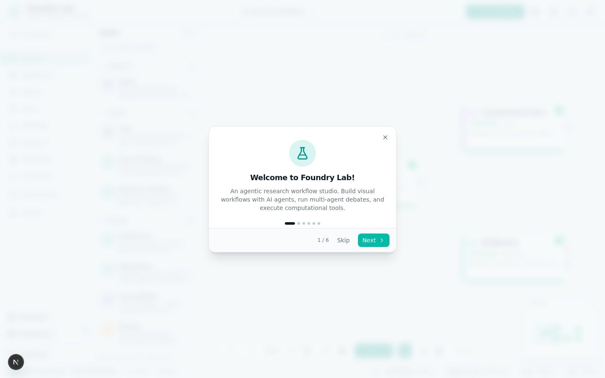

引导会逐步高亮界面各区域，跟随点击 **Next** 即可；随时可点
**Skip tour** 跳过。之后想再看一遍，顶栏有 **Restart onboarding tour** 按钮。

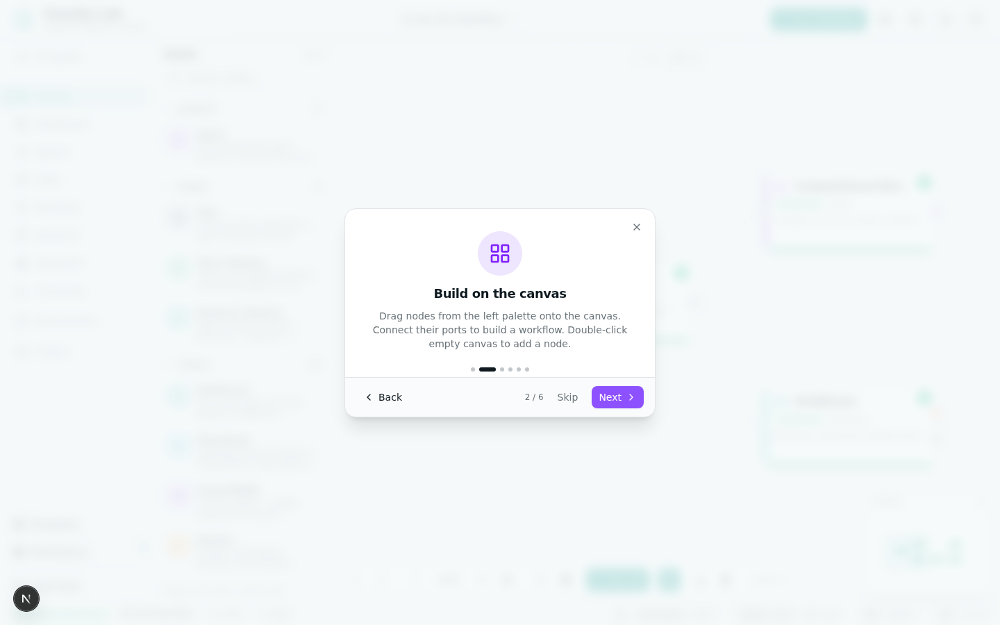

> 💡 如果画布是空的：点击左侧导航栏底部的 **Seed Data** 按钮，
> 一键生成 9 个预置专家智能体 + 示例工作流。
> Screening 面板还内置两个演示 campaign（60 候选 / 20 候选），
> 第 6 章会用到。

---

## 2. 界面总览：五分钟认识工作台

整个应用是**单页工作台**，布局如下：

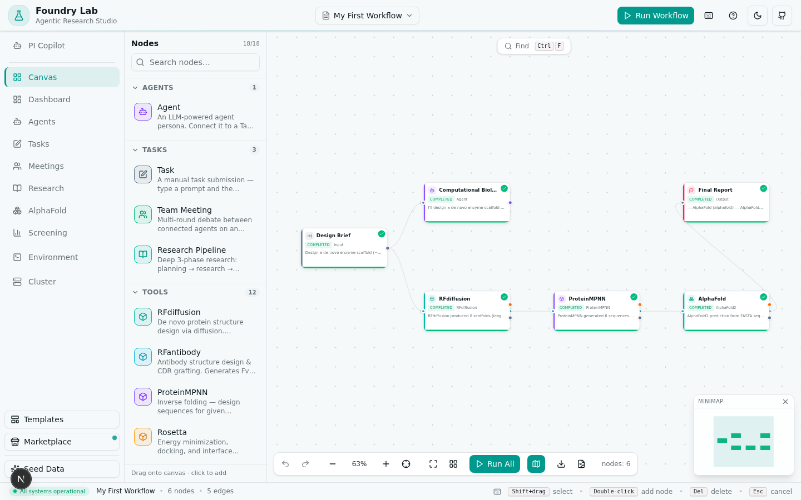

| 区域 | 名称 | 作用 |
|---|---|---|
| 顶部 | **顶栏** | 工作流切换器、Run Workflow 一键全跑、快捷键帮助、引导重启、暗色模式、GitHub 链接 |
| 左侧竖条 | **导航栏** | PI Copilot / Canvas / Dashboard / Agents / Tasks / Meetings / Research / AlphaFold / Screening / Environment / Cluster / Templates / Marketplace |
| 左侧面板 | **节点目录** | 按类别分组的节点：Agents(1) / Tasks(3) / Tools(12) / I/O(2)，支持搜索 |
| 中间 | **画布** | 拖拽编排节点、连线、运行；点阵背景；右下角小地图 |
| 右侧 | **检查器** | 选中节点后出现：参数、日志、任务历史、产物 |
| 底部 | **状态栏** | 节点/边数量、缩放控制、撤销重做、自动布局、导出 |

移动端导航栏收缩为纯图标宽度，面板全部可用（见[第 12 章](#12-移动端使用)）。

### 2.1 三个主要工作区

- **画布（Canvas）**：搭工作流的地方，本章主角。
- **面板区（Agents / Meetings / Research / …）**：每个功能的专用管理界面，
  从导航栏一键切换。
- **浮层（Environment / Cluster / PI Copilot / Templates）**：以侧滑抽屉形式
  浮在画布之上，让你边看画布边操作。

### 2.2 节点目录里有什么

| 分组 | 节点 | 用途 |
|---|---|---|
| Agents | Agent | LLM 智能体（接给会议/研究/任务节点参与协作） |
| Tasks | Task / Team Meeting / Research Pipeline | 手动任务提交 / 多智能体辩论 / 三阶段深度研究 |
| Tools | RFdiffusion、RFantibody、ProteinMPNN、LigandMPNN、SolubleMPNN、Rosetta、PyRosetta、RoseTTAFold3、ESMFold、ColabFold、AlphaFold2、Bio Tool | 12 种计算工具，每种都是独立节点 |
| I/O | Input / Output | 文本输入 / Markdown 报告输出 |

目录顶部有**搜索框**，输入关键词即时过滤（比如输入 `mpnn`）。

---

## 3. 快速上手：搭建第一条完整工作流

本章从零搭一条蛋白质设计经典链路：

```
设计简报 → RFdiffusion(骨架生成) → ProteinMPNN(序列设计) → AlphaFold(结构验证) → 最终报告
```

完成后你会得到和下图一样的画布：


### 3.1 添加第一个节点：Input

两种方式任选：

1. **双击画布空白处** → 在弹出的搜索里选择节点类型；
2. **从左侧目录按住拖入** 画布目标位置。

选择 **Input**，节点落在画布上（状态 `idle`）。双击节点名可重命名，
改成 `Design Brief`。

### 3.2 填写设计简报

单击 Input 节点，右侧弹出**检查器**。在 **Text** 参数框中粘贴你的简报，例如：

```text
Design a de-novo enzyme scaffold (~150 aa) with a stable helical core,
design binding sequences, and validate by structure prediction.
```

参数会自动保存（乐观更新，无需点保存按钮）。

### 3.3 添加 RFdiffusion 并连线

从目录拖一个 **RFdiffusion** 节点到 Input 右侧。

**连线**：把鼠标悬停在 Input 节点右侧的输出端口圆点
（`text`），按住**拖到** RFdiffusion 左侧的 `input` 端口圆点上松手。
端口有类型校验（颜色区分：text/context/files/agent…），类型不匹配的
连线会自动弹开。

> 💡 端口提示：拖动时候选端口会高亮；`*` 通配端口可以接任何类型。

### 3.4 运行节点，看真实日志

选中 RFdiffusion 节点，检查器里点 **Run**（或按 `Ctrl+Enter`）：


节点状态变为 `running`，进度条增长，检查器下半部分**实时流出日志**。
日志来自真实算法引擎（本地没有装原生 RFdiffusion 时自动走内置引擎）：

```text
[built-in real algorithm engine]
RFdiffusion-style de-novo design — REAL algorithm engine
(Ramachandran-basin torsion diffusion + NeRF assembly)
Length=150 | designs=8 | symmetry=none | seed=314
Design 1/8: 150 residues | H=94 E=23 L=33 | rama-LL=-12.21 | clashes=2
...
RFdiffusion produced 8 scaffolds (length 150). All outputs written as PDB.
```

运行结束节点变 `completed`（绿色勾），产物 PDB 文件已经写入 `outputs/` 目录。

### 3.5 关键特性：下游工具自动接线

现在拖一个 **ProteinMPNN** 节点，连上
RFdiffusion 的 `files` 输出 → ProteinMPNN 的 `input`，然后运行它。
观察日志：

```text
[chain] auto-wired pdb_path from upstream output:
  outputs/rfdiffusion/.../design_1.pdb
```

**你不需要手动把上游产物填进下游参数** —— 连线之后，引擎会自动把
上游节点 `##OUTPUTS##` 尾注里声明的 PDB/FASTA 文件接线到下游工具的
`pdb_path` / `fasta_path`。这是本平台工作流的灵魂特性。

### 3.6 AlphaFold 验证 + 报告输出

同样地：

1. 再拖一个 **AlphaFold** 节点，连接 ProteinMPNN 的 `files` → AlphaFold 的
   `input`，运行（多序列预测，几秒到几十秒）；
2. 拖一个 **Output** 节点，连接 AlphaFold 的 `summary` → Output 的 `value`，
   运行后它把上游输出渲染成 Markdown 报告。

### 3.7 一键全跑

顶栏 **Run Workflow** 按钮按**拓扑序**自动执行整张图：
无依赖的节点并行跑，有依赖的等上游完成。适合搭好图之后整体重跑
（改参数 → Run Workflow → 看报告）。

### 3.8 画布常用操作速查

| 操作 | 方式 |
|---|---|
| 添加节点 | 双击空白处 / 从目录拖入 |
| 连线 | 从输出端口圆点拖到输入端口 |
| 运行选中节点 | 检查器 Run / `Ctrl+Enter` |
| 框选 | `Shift` + 拖拽 |
| 删除节点/边 | 选中后 `Delete` |
| 撤销 / 重做 | `Ctrl+Z` / `Ctrl+Shift+Z` |
| 查找节点 | `Ctrl+F` |
| 视图复位 / 适配 | 底部工具栏 Reset view / Fit to content |
| 自动整理 | 底部工具栏 Auto-arrange layout |
| 小地图 | 右下角，可开关，点击可跳转 |
| 导出图像 | 底部工具栏 Export PNG / SVG |

---

## 4. 查看 3D 蛋白质结构

任何工具节点跑完都会产生真实 PDB 产物。查看方式：

1. 选中节点 → 检查器展开某次任务 → 点 **View outputs**；
2. 在输出对话框中切到 **Structure** 标签页。

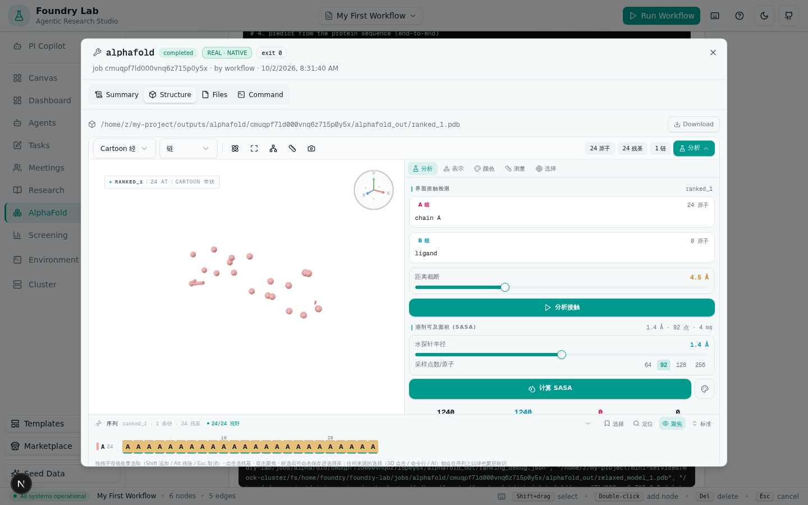

查看器能力：

- **表示模式**：Cartoon（默认）/ 球棍 / 空间填充；
- **着色**：按链 / 按残基 / 按二级结构；
- **分析面板**（右侧标签页）：分析（氢键、SASA、接触）、表示、颜色、
  测量（距离/角度）、选择；
- **序列条**：底部氨基酸序列，与 3D 视图双向联动 ——
  点序列残基即选中 3D 中的对应残基；
- 鼠标左键旋转、滚轮缩放、右键平移；右上角工具条有复位视图 /
  全屏 / 截图。

> 🧪 DSSP 二级结构标注与 SASA 由 Web Worker 后台计算，
> 大体系也不卡界面。

---

## 5. 智能体（Agents）：会调用工具的 AI 同事

### 5.1 智能体面板

导航栏 → **Agents**：

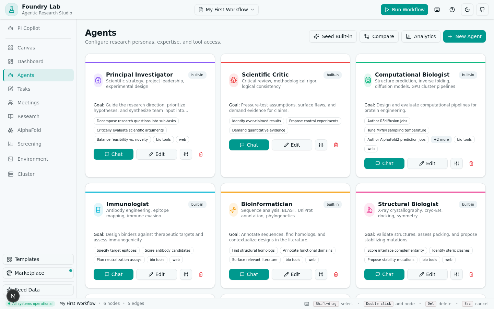

每个智能体是一张**专家人格卡**：头衔、专长、目标、角色、知识域
（领域知识 + 能力清单）、模型与运行时参数。预置 9 位专家：
Principal Investigator（PI）、Scientific Critic、Computational Biologist、
Immunologist、Bioinformatician、Structural Biologist、ML Engineer、
Biochemist、Cell Biologist。

卡片上的操作：

| 按钮 | 作用 |
|---|---|
| **Chat** | 打开聊天抽屉，直接对话 |
| **Edit** | 编辑人格 / 知识配置 / 系统提示词 |
| **Fine-tune** | 微调运行时参数（见 5.3） |
| **Compare** | 多智能体配置并排对比 |
| **Analytics** | 该智能体的调用统计 |

### 5.2 聊天与自主工具调用

点 **Chat** 打开抽屉，像和同事一样提问。试试：

```text
Which scaffold from the screening campaign should we prioritize
for wet-lab validation, and why?
```

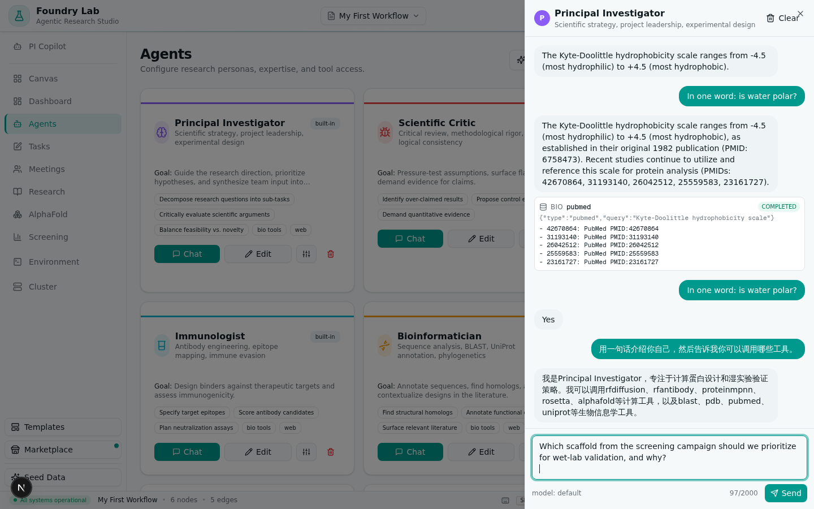

注意回复中的 **PubMed ID 与检索结果** —— 智能体在回答前自主发起了
真实 API 调用（BLAST / PDB / PubMed / UniProt），调用过程在聊天流中
可见。工具调用循环最多 5 轮，bio 与 comp 工具可并行。
输入框支持 `Ctrl/Cmd+Enter` 发送，回复**流式**输出。

### 5.3 微调运行时参数（真实持久化）

点卡片上的 **Fine-tune**，可配置：

| 参数 | 说明 |
|---|---|
| temperature | 采样温度 |
| max-tokens | 回复长度上限 |
| top-p | 核采样 |
| extra system instructions | 附加系统指令 |
| verbose / streaming | 详细日志 / 流式输出 |

这些参数**持久化在数据库**，作用于该智能体之后每一次 LLM 调用
（聊天、会议、研究、画布节点全部生效）。

### 5.4 团队会议：多智能体辩论

导航栏 → **Meetings** → 填写议程：

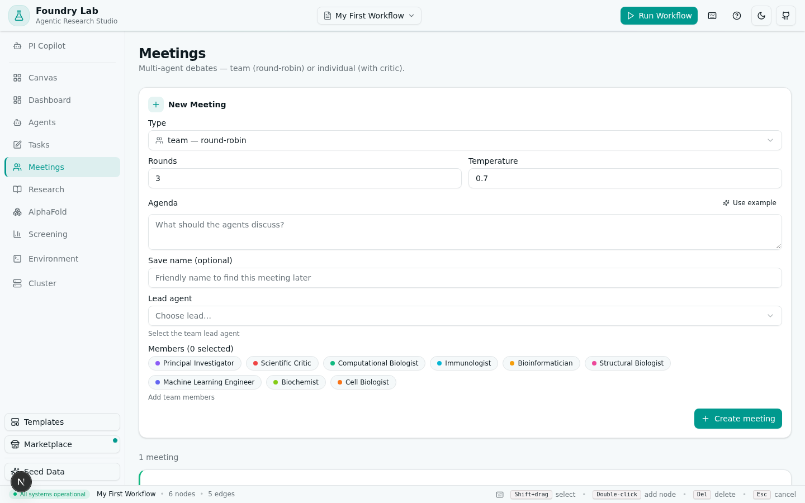

选择 **Type**（团队会议 / 个人会议）、轮数、温度、议程，指定
**Lead** 与 **Members**，点 **Create meeting** 后运行。多轮辩论的每一轮
发言实时流出，最终产出结构化会议纪要（结论、分歧、行动项）。

### 5.5 研究管线：三阶段深度研究

导航栏 → **Research**：

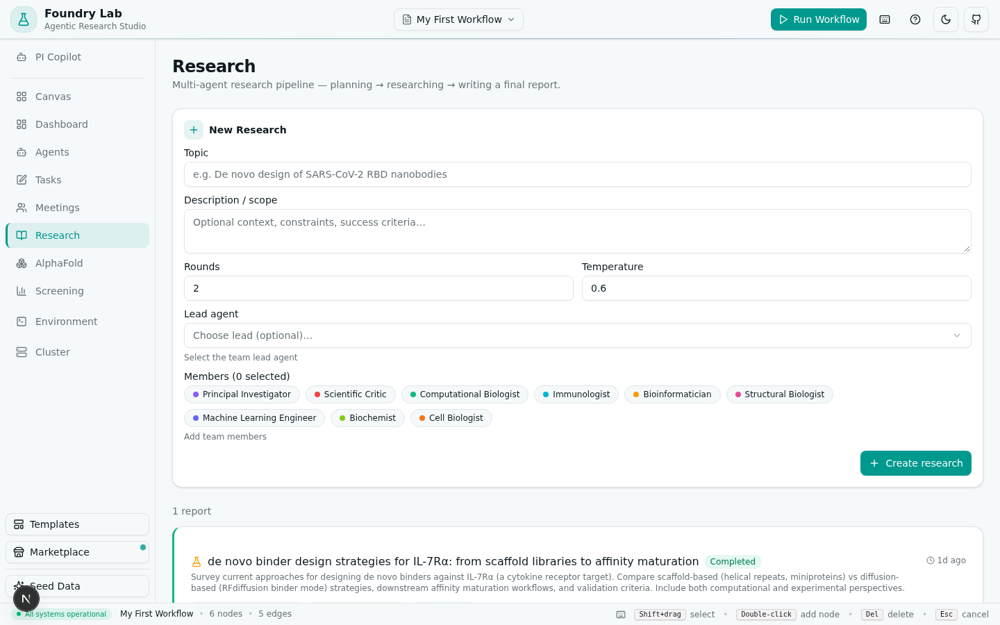

填写 **Topic** / 描述 / 轮数 / 温度，选 lead 和成员，
**Create research**。管线分三阶段执行：

```
Planning（规划检索策略） → Researching（多轮检索+工具调用） → Compilation（撰写）
```

最终产出一份 Markdown 研究报告（面板中可查看历史报告，
如示例中的 *de novo binder design strategies for IL-7Rα*）。

### 5.6 画布上的智能体节点

把 **Agent** 节点拖上画布并指定 refId（对应哪位专家），可以：

- 连接 **Task** 节点：手动提交任务，连接的智能体响应；
- 连接 **Team Meeting / Research Pipeline** 节点：作为成员参与；
- 连接 **Input**：把上下文喂给智能体。

第 3 章示例工作流中，`Computational Biologist` 节点就是从
`Design Brief` 接收上下文后给出设计意见的。

### 5.7 PI Copilot：画布悬浮助手

导航栏最上方的紫色 **PI Copilot** 按钮打开侧滑抽屉 —— 它浮在画布之上，
你可以一边盯着工作流一边和 PI 讨论：

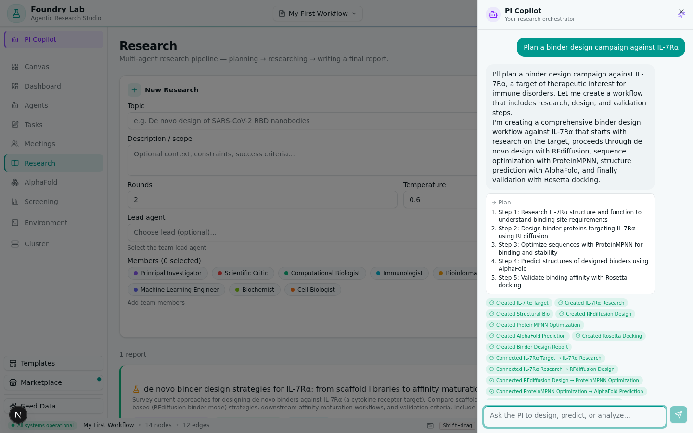

---

## 6. 大规模筛选评估与排序（核心功能）

> 场景：一轮批量设计跑出几十上百个候选（多个 seed × 多个模型 ×
> 多条序列），如何快速评估、排序、挑出最优？
> Screening 面板就是为此设计的完整体系。

导航栏 → **Screening**：

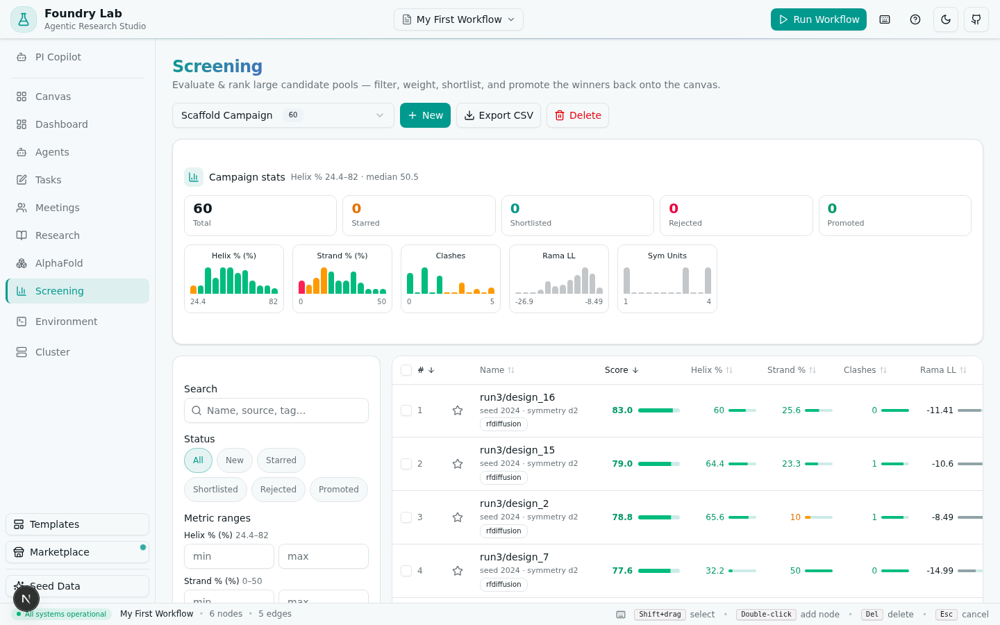

界面分四块（自上而下 / 左右）：

1. **顶部**：campaign 选择器 + New / Rescan / Export / Delete；
2. **统计条**：Total / Starred / Shortlisted / Rejected / Promoted 计数卡
   + 每个指标的**质量直方图**（12 桶，颜色编码质量区间）；
3. **左侧控制列**：搜索、状态过滤、指标范围过滤、**权重滑杆**；
4. **主表**：综合评分 + 各指标列，内置质量色与迷你条形图。

内置两个演示 campaign 可直接体验：
**Scaffold Campaign**（3 次 diffusion 运行 × 20 设计 = 60 候选）与
**AF2 Model Ranking**（4 序列 × 5 预测 = 20 候选，带 pLDDT/pTM）。

### 6.1 候选从哪里来（原理）

工具节点的真实运行产物（`metrics.json`、`ranking_debug.json`、
PDB 结构解析）被**收割器**自动采集：

- diffusion 运行 → 每个设计一条候选（helix% / strand% / clashes / rama-LL…）；
- 折叠运行 → 每个模型一条候选（pLDDT / pTM）；
- 外部文件自动复制到 `outputs/screening/<id>/` 统一管理；
- **Rescan** 增量收割新完成的运行（自动去重）。

### 6.2 读懂综合评分

```text
score = 100 · Σ(wᵢ · normᵢ) / Σwᵢ     norm = (v−min)/(max−min)
```

指标在观测域内归一化（lower-is-better 自动反转），乘以权重后归一成
0-100 分。**权重是滑杆，拖动即全表实时重排** —— 这是本功能最爽的
交互：你能直观看到"更看重可设计性"时排名怎么变。

### 6.3 调权重与预设

左侧控制列底部是每个指标的**权重滑杆（0-5）**与 4 个预设按钮：

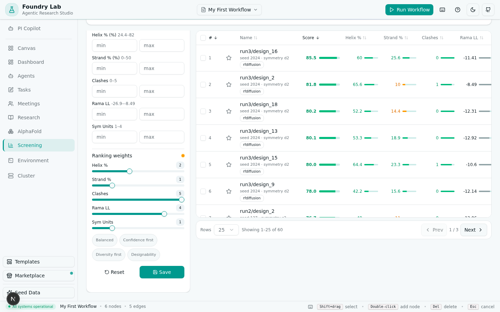

上图是点击 **Designability** 预设后的状态（滑杆变为 2/1/5/4/1，
表格已按新权重实时重排）。预设之外手动微调，然后点 **Save**
把权重持久化到服务端（未保存时按钮上有未保存标记，刷新即丢）。

### 6.4 过滤与排序

- **搜索框**：按名称 / 来源 / 标签过滤；
- **状态 chips**：All / New / Starred / Shortlisted / Rejected / Promoted；
- **指标范围**：每个指标一对 min/max 输入框（比如 clashes ≤ 5）；
- **表头三态排序**：点击列头循环 升序 → 降序 → 取消；
- **分页**：底部 25 / 50 / 100 每页切换。

### 6.5 标记与批量操作

勾选行（或表头全选本页）后，表格上方出现批量操作条：
**Star / Shortlist / Reject / Compare / Promote to Canvas / Export**。

单行快速星标直接点行首的 ⭐。

### 6.6 双候选对比

选中两行 → **Compare**：

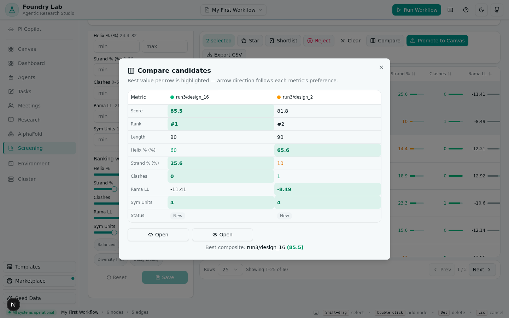

逐指标并排，**每行的最优值自动高亮**（并列时两者都高亮），
一眼看出谁在哪个维度占优。

### 6.7 候选详情 + 3D

点击任意行打开**详情抽屉**：

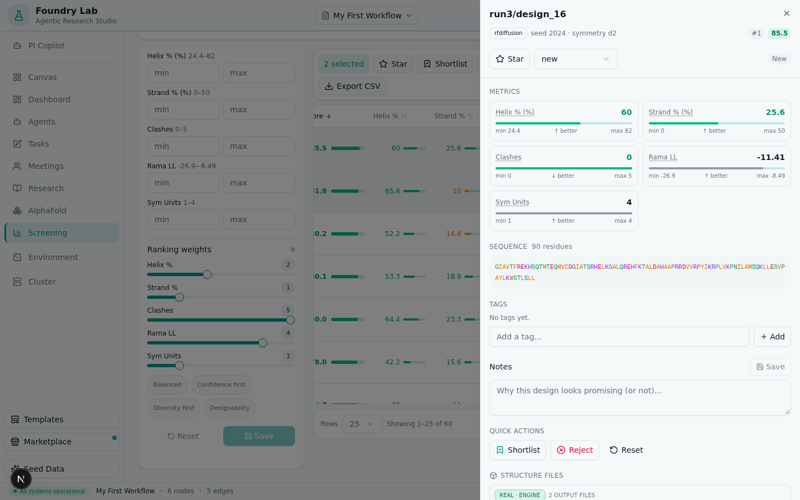

- **指标网格**：全部指标 + 质量色 + 排名；
- **着色序列**：按残基性质着色的氨基酸序列；
- **标签 / 笔记**：可添加自定义 tag 与笔记（持久化）；
- **结构文件**：真实 PDB/FASTA，可下载、可预览。

向下滚动到 **STRUCTURE FILES**，3D 结构直接内嵌渲染：

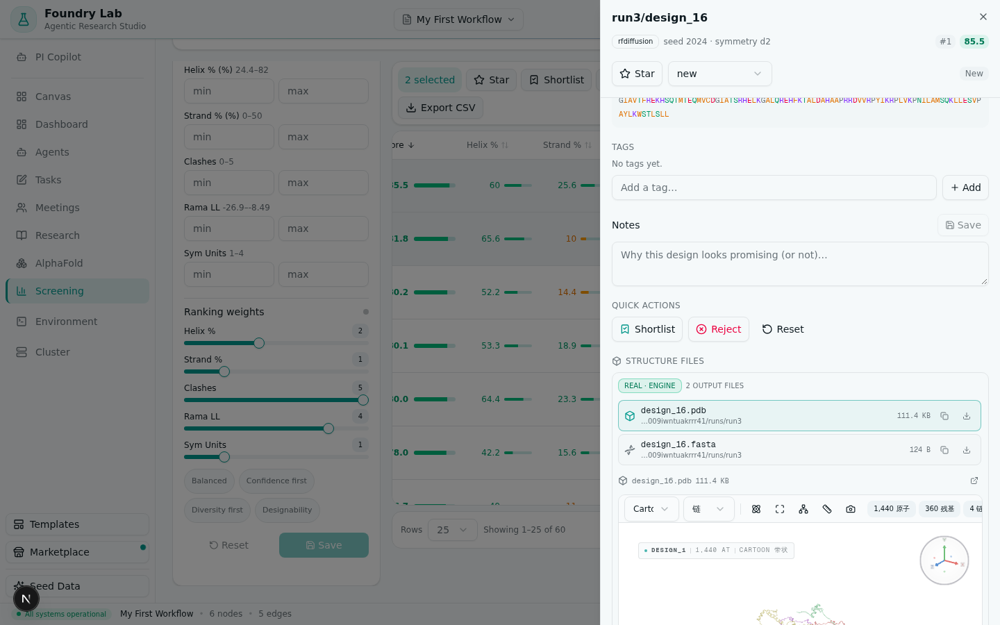

### 6.8 Promote：把候选送回画布（闭环）

挑中满意的候选后，选中 → **Promote to Canvas**：

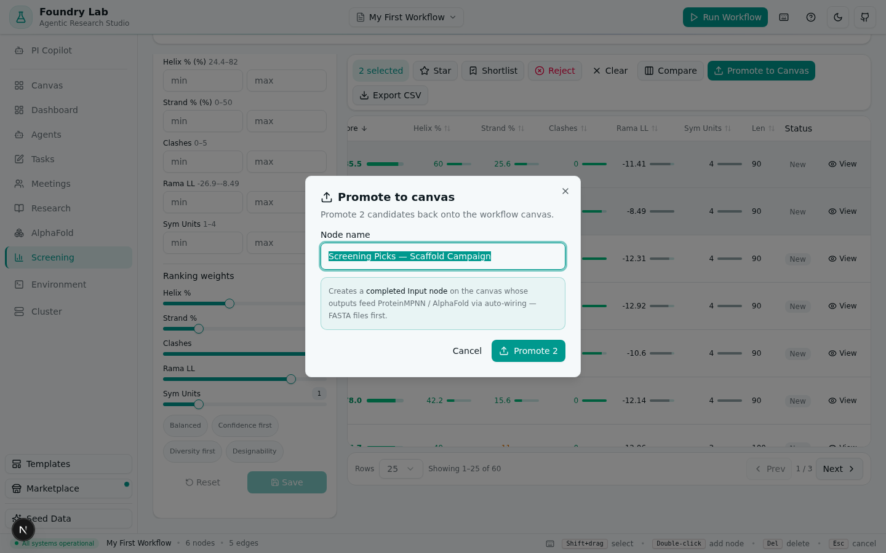

确认后应用自动切回画布，一个新的 **Input 节点**出现，其日志
内嵌 `##OUTPUTS##` 尾注（声明该候选的 fasta/pdb 文件）。

**杀手级用法**：从 Promote 出来的节点直接连一个新的 ProteinMPNN
节点并运行 —— 引擎自动把候选的 PDB 接线为 `pdb_path`，
在真实骨架上采样新序列。日志会显示：

```text
[chain] auto-wired pdb_path from upstream output:
  outputs/screening/<campaign>/runs/run3/design_16.pdb
```

至此闭环完成：**批量设计 → 筛选评估 → 人工决策 → 回到画布继续迭代**。

### 6.9 导出与新建

- **Export CSV**：当前 campaign（或选中行）导出为 CSV
  （含全部指标与评分）；
- **New**：新建 campaign —— 选择来源（工具运行 / 节点 / 演示），
  可选填写名称与描述；
- **Rescan**：对已有 campaign 增量收割新的运行产物。

---

## 7. AlphaFold2 结构预测

导航栏 → **AlphaFold**：

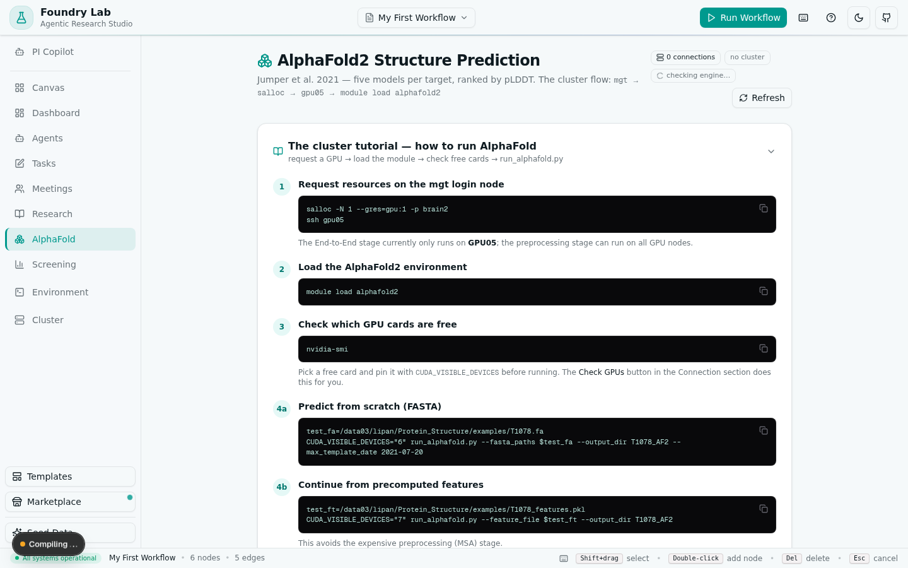

> **为什么 AlphaFold2 有独立页面？** 它分两层各司其职：
> **Environment（环境面板）= 管理层** —— AlphaFold2 与其他外部工具一样
> 登记在"Structure Prediction"分类下，负责检测/安装/回退状态；
> **本页 = 使用层（工作台）** —— 面向"粘贴序列 → 出结构"的高频单步操作。
> 两层已交叉链接：环境面板的 AlphaFold2 卡片带 **Open workbench**
> 按钮直达本页，本页头部带 **Environment / Cluster** 入口返回管理层。
> 它同时也可以作为画布节点嵌入自动化工作流（见第 3 章）。

两条执行通道：

| 通道 | 条件 | 流程 |
|---|---|---|
| **集群通道（主）** | 配好 SSH 集群连接 | `salloc` 申请 GPU → `ssh gpu05` → `module load alphafold2` → `run_alphafold.py`，完整输出树同步回本地 |
| **本地通道（回退）** | 无集群 | 内置 Structure Prediction Engine（Chou-Fasman 等经典算法，诚实定位为基线，**不是** AF2 网络） |

输入支持 FASTA 序列或预计算的 `features.pkl`（跳过 MSA 阶段）。
输出包含 `ranked_0..4.pdb`（按 pLDDT 排序）、relaxed/unrelaxed 模型、
`ranking_debug.json`、`msas/`，全部可在 3D 查看器中打开。
折叠产物同时自动进入 Screening 收割范围。

集群连接的配置见[第 9 章](#9-集群执行ssh--slurm--gpu)。

---

## 8. 环境与工具链管理（跨系统检测与安装）

导航栏 → **Environment**（侧滑抽屉）。面板最上方是**平台横幅**：

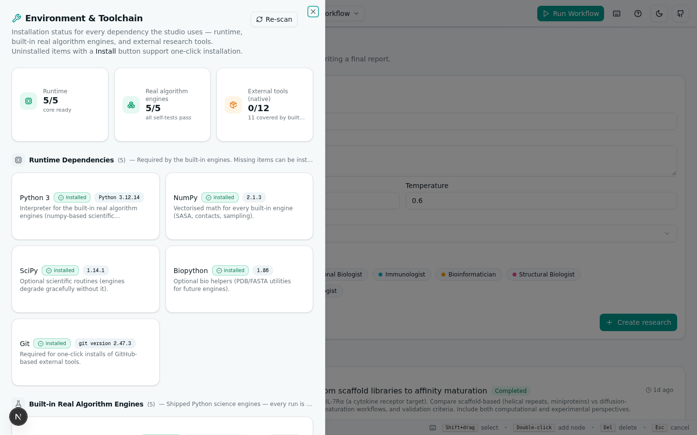

```
🖥 Debian GNU/Linux 13 (trixie) · x64 · bash
Python: /home/z/.venv/bin/python3 (Python 3.12.14)
Package managers: [apt-get] [uv] [pip]
```

- **操作系统**：实时探测（Linux 读 `/etc/os-release`，macOS 调
  `sw_vers`，Windows 解析 `ver`），含发行版名；
- **Python 解析**：按 python3 → venv → python → Windows `py -3` 顺序
  找到引擎可用的解释器（能 `import numpy` 的那个）；
- **包管理器探测**：apt / dnf / yum / pacman / zypper / apk / nix /
  brew / winget / choco / scoop（系统级）+ conda / mamba / uv / pixi
  （通用）+ pip（Python 级），探测到哪个就亮哪个 chip。

横幅之下是三个层级：

1. **Runtime**：python3 / numpy / scipy / biopython / git 实时版本探测；
2. **Engines**：5 个内置真实算法引擎逐个**自检**（PASS/FAIL）：
   Backbone Diffusion / Structure Prediction / Inverse Folding /
   Knowledge-Based Scoring / Antibody Design；
3. **External**：RFdiffusion、ProteinMPNN、Rosetta… 的安装状态
   （含回退映射说明）。

### 8.1 跨系统检测原理

二进制探测**不经过 shell**：直接扫描 `PATH` 目录（Windows 还会带上
`PATHEXT` 的 .exe/.bat/.cmd 扩展名逐个匹配），所以 Linux / macOS /
Windows 行为完全一致，不依赖 `which` / `where` 的差异。Python 模块探测
用解析到的解释器真实 `import` 一次。

### 8.2 一键安装：按系统选通道

点 **Install** 后，安装命令按当前系统走不同通道，日志第一行会标注
使用的通道：

| 你的系统 | 命令类型 | 执行通道 |
|---|---|---|
| Linux / macOS | 任意 | `bash -c`（无 bash 时退化 `sh`） |
| Windows | pip 类 | `cmd.exe`（命令重写为 `py -3 -m pip …`，规避 PEP-668） |
| Windows | POSIX 脚本（git clone 流程等） | `wsl -e bash -c`（**WSL**） |
| Windows | POSIX 脚本且无 WSL | 拒绝并提示 `wsl --install`，同时告知可用内置引擎回退 |

**系统级依赖**（python3 / git）的一键安装按探测到的包管理器生成真实
命令：Debian/Ubuntu → `sudo apt-get install -y python3`；macOS →
`brew install python3`；Windows → `winget install -e --id Python.Python.3.12`
（或 choco / scoop）。扫描时实时判定"是否可一键装"，界面上显示的命令
就是按钮实际执行的命令。

安装过程终端输出**实时流式**显示，安装完成自动重扫状态。安装位置与
引擎运行时一致（pip 类装进解析到的解释器环境）。

> 💡 没装任何外部工具也完全可用 —— 所有工具自动回退到内置引擎。
> Windows 用户建议装 WSL：POSIX 系工具（RFdiffusion 等）的安装脚本
> 会自动经 WSL 执行。

---

## 9. 集群执行：SSH / Slurm / GPU

导航栏 → **Cluster**（侧滑抽屉，宽幅）：

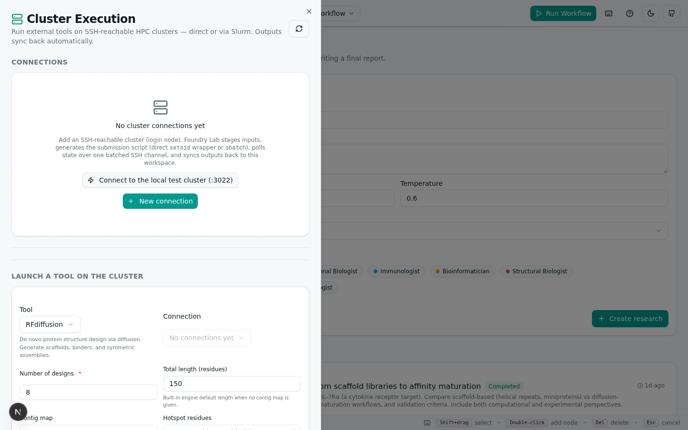

功能：

1. **连接管理**：添加 SSH 连接（IP + 用户名/密码），
   一键 **Test** 连通性；
2. **探测**：自动探测节点上的工具布局、GPU 拓扑（`nvidia-smi`）；
3. **派发模式**：直连执行 / Slurm（`salloc` 提交）；
4. **集群任务**：任务列表 + 实时日志流，产物同步回本地 `outputs/`。

集群上跑的工具与本地跑走**同一套**产物收割 → 筛选评估路径，
所以第 6 章的流程对集群任务同样适用。

---

## 10. 版本快照、定时运行与导入导出

导航栏下方 → **Templates** 打开管理对话框，包含四个区块：

### 10.1 Export / Import

- **Export**：当前画布导出为 JSON（节点/边/参数全量）；
- **Import**：导入 JSON 恢复一张图 —— 跨项目迁移、备份、分享。

### 10.2 模板库

预置工作流模板（如 **Nanobody Design Pipeline**、
**AlphaFold Structure Prediction**），一键载入成画布起点；
**Marketplace** 里还有更多社区模板（按 design / research / analysis /
education / production 分类）。

### 10.3 Version History（版本快照）

- **保存快照**：把当前画布（节点+边）快照进数据库；
- **恢复**：任意历史快照一键**事务性恢复**
  （恢复前有确认提示，展示节点/边数量对比；其他快照保留）。

### 10.4 Schedule（定时运行）

- 选择未来时间 + 可选标签 → **预约运行**；
- 后台清扫器随服务器启动（`instrumentation.ts`），
  到点自动通过与手动运行**完全相同**的执行通道触发；
- **重启安全**：停机期间错过的计划，重启后自动补跑；
- 可查看计划列表与历史（fired / failed / cancelled），支持取消。

---

## 11. 效率工具：命令面板与快捷键

### 命令面板

按 `Ctrl+K`（macOS `Cmd+K`）随时呼出：

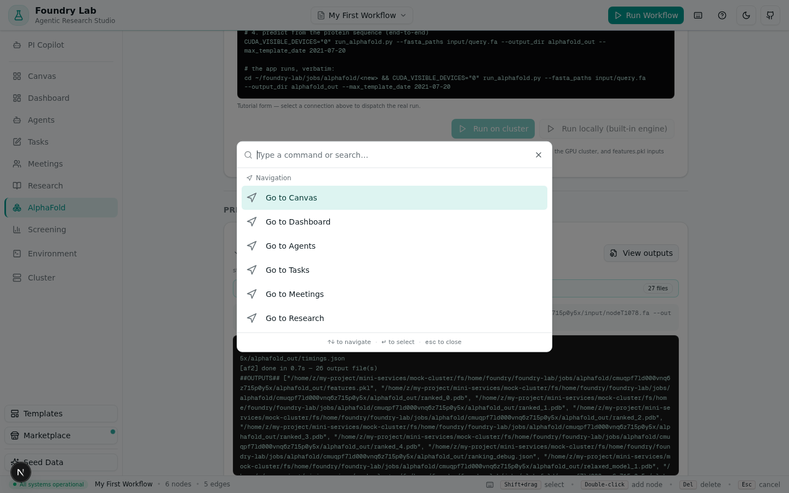

输入关键词即可跳转任意面板 / 触发动作（导航、运行、创建节点……），
不用碰鼠标。

### 完整快捷键表

| 快捷键 | 作用 |
|---|---|
| `Ctrl+K` | 命令面板 |
| `Ctrl+F` | 画布查找节点 |
| `Ctrl+Z` / `Ctrl+Shift+Z` | 撤销 / 重做 |
| `Ctrl+Enter` | 运行选中节点 |
| `Delete` | 删除选中节点/边 |
| `Esc` | 取消选择 / 关闭浮层 |
| `Shift+拖拽` | 框选 |
| 双击画布空白 | 添加节点 |
| `Ctrl/Cmd+Enter`（聊天框内） | 发送消息 |

顶栏键盘图标（**Keyboard shortcuts**）可随时查看此表。

---

## 12. 移动端使用

应用为移动端完整适配（375px 宽验证无溢出）：

- **导航栏**收缩为图标条；
- **表格 → 卡片列表**：筛选结果在手机上以卡片呈现（排名、评分条、
  指标），顶部统计卡与质量直方图保留：

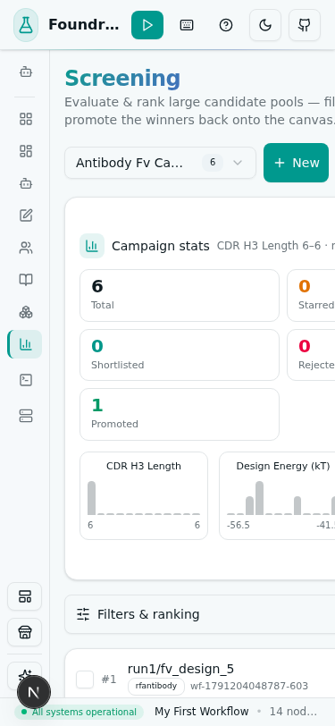

- **画布全屏可用**：节点目录在手机上默认收起，画布占满全宽，
  触摸拖动 / 缩放 / 小地图照常工作：

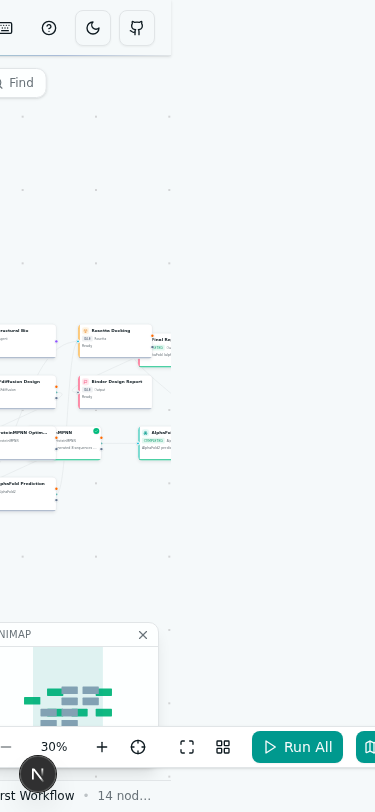

- **节点目录按需滑出**：画布左下工具栏的第一个按钮（面板图标）
  唤出节点目录浮层；点选节点后自动收起，也可点浮层右上角 ×
  或直接点半透明遮罩关闭：

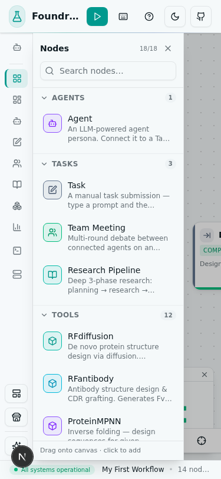

- 所有抽屉（Environment / Cluster / PI Copilot）在窄屏全屏展开；
- 触控目标 ≥ 44px。

---

## 13. 常见问题与故障排查

**Q：节点运行失败（红色状态）怎么办？**
点开节点检查器看日志末尾 —— 常见原因：python3/numpy 缺失
（去 Environment 面板一键安装）、参数非法（如长度为 0）、
上游产物缺失（先跑上游节点）。

**Q：连线总是弹开？**
端口类型不匹配。悬停端口看颜色/提示：text(灰) / context(青) /
files(橙) / agent(紫) / query(粉)…… 只有 accepts 列表包含源类型的
端口才能接（`*` 通配口除外）。

**Q：ProteinMPNN 报"没有 pdb_path"？**
它需要上游骨架。连一条 RFdiffusion（或 Screening Promote 节点）的
`files` → `input` 边再运行，引擎会自动接线；显式填写参数时以
显式值为准（explicit-input-wins）。

**Q：智能体聊天很慢 / 没反应？**
带工具调用的问题会多轮检索（BLAST/PubMed 网络请求），耐心等待；
流式输出在 Fine-tune 里开启。仍无响应看 dev server 日志。

**Q：筛选表里候选指标是假的吗？**
不是。全部从真实运行产物收割（metrics.json / ranking_debug.json /
PDB 结构解析）。演示 campaign 由真实引擎跑出。

**Q：权重滑杆拖了但刷新后丢了？**
忘了点 **Save**。保存后权重持久化到服务端 campaign 记录。

**Q：如何彻底重置演示数据？**
Screening 面板 Delete campaign；节点/边在画布选中删除；
智能体在 Agents 面板编辑/删除。Seed Data 可随时重新生成。

**Q：支持哪些语言 / 暗色模式？**
界面为英文（分子查看器面板为中文）；顶栏月亮图标切换暗色模式。

---

## 附：推荐学习路径

```text
第 1 天   第 2 章 + 第 3 章      → 跑通第一条工作流，看真实日志与 3D
第 2 天   第 5 章               → 和智能体聊起来，发起一场会议
第 3 天   第 6 章               → 体验大规模筛选 + Promote 闭环
第 4 天   第 7-10 章            → 接入集群 / 快照 / 定时任务
之后      模板库 + Marketplace   → 用模板加速日常项目
```

遇到问题回[第 13 章](#13-常见问题与故障排查)。祝科研顺利 🧬
